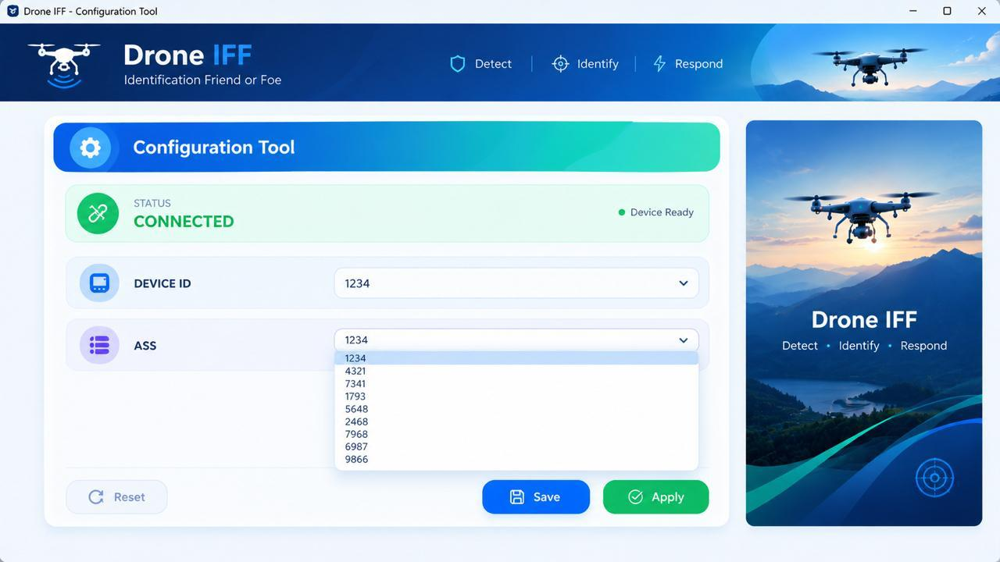

# 🚁 Drone IFF Configuration & Monitoring Application

A professional PyQt5 desktop application for configuring and monitoring a Drone IFF system.

This project provides a modular architecture for device configuration, input validation, persistent configuration storage, device-state management, logging, automated testing, and hardware-independent simulation.

> **Note:** The application currently operates in simulation mode because physical IFF hardware is not available. The architecture is designed to support future hardware integration when the required hardware communication specifications are available.

## Application Preview



### ✨ Features

- 🖥️ PyQt5 desktop application
- ⚙️ Device ID and ASS configuration
- ✅ Configuration validation
- 💾 JSON-based configuration persistence
- 🔄 Configuration reset functionality
- 🔌 Device connection management
- 🟢 Device status monitoring
- 🧪 Hardware-independent simulation mode
- 📝 Application event logging
- 🛡️ Error handling
- 🧱 Modular backend architecture
- 🧪 Automated testing with Pytest
- 🔧 Hardware-ready device abstraction

### 🏗️ Application Architecture

```text
                    ┌─────────────────────────┐
                    │       PyQt5 UI          │
                    │       main.py           │
                    └────────────┬────────────┘
                                 │
                                 ▼
                    ┌─────────────────────────┐
                    │     DeviceManager       │
                    │ Device State Management │
                    └────────────┬────────────┘
                                 │
                    ┌────────────┴────────────┐
                    ▼                         ▼
          ┌──────────────────┐      ┌──────────────────┐
          │    Simulator     │      │ Future Hardware  │
          │   Device Layer   │      │   Integration    │
          └──────────────────┘      └──────────────────┘

          ┌──────────────────┐
          │  ConfigManager   │
          │ JSON Persistence │
          └──────────────────┘

          ┌──────────────────┐
          │ ConfigValidator  │
          │ Input Validation │
          └──────────────────┘

          ┌──────────────────┐
          │    AppLogger     │
          │   Event Logging  │
          └──────────────────┘
```

### 📂 Project Structure

```text
Drone-IFF-Configuration-Monitoring/
│
├── backend/
│   ├── __init__.py
│   ├── config_manager.py
│   ├── device_interface.py
│   ├── device_manager.py
│   ├── logger.py
│   ├── simulator.py
│   └── validator.py
│
├── tests/
│   ├── __init__.py
│   ├── test_config_manager.py
│   ├── test_device_manager.py
│   └── test_validator.py
│
├── main.py
├── main.ui
├── config.json
├── device.log
├── README.md
└── .gitignore
```

### 🛠️ Technologies Used

| Technology | Purpose |
|---|---|
| Python | Application development |
| PyQt5 | Desktop GUI |
| Qt Designer | UI design |
| JSON | Configuration persistence |
| Pytest | Automated testing |
| Git | Version control |
| GitHub | Source code hosting |

### ⚙️ Installation

Clone the repository:

```bash
git clone https://github.com/dhanyasreegopinigari-blue/drone-iff-configuration-monitor.git
```

Navigate to the project:

```bash
cd drone-iff-configuration-monitor
```

Create a virtual environment:

```bash
python -m venv .venv
```

Activate the virtual environment on Windows PowerShell:

```powershell
.\.venv\Scripts\Activate.ps1
```

If PowerShell blocks activation:

```powershell
Set-ExecutionPolicy -Scope Process -ExecutionPolicy Bypass
.\.venv\Scripts\Activate.ps1
```

Install the required dependencies:

```bash
python -m pip install PyQt5 pytest
```

### ▶️ Running the Application

After activating the virtual environment, run:

```bash
python main.py
```

The PyQt5 desktop application will open.

### 🧪 Testing

Run the complete automated test suite:

```bash
python -m pytest
```

Current test result:

```text
16 passed
```

The tests cover:

- Configuration validation
- Configuration saving
- Configuration loading
- Configuration reset
- Device configuration
- Device connection
- Device disconnection
- Device state management
- Simulation behaviour

### 🔄 Application Workflow

```text
Start Application
       │
       ▼
Load Interface
       │
       ▼
Select Device ID
       │
       ▼
Select ASS
       │
       ▼
Validate Configuration
       │
       ├── Invalid ──► Show Error
       │
       ▼
Configure Device
       │
       ▼
Connect Device
       │
       ▼
Monitor Device Status
       │
       ▼
Save / Reset Configuration
```

### 🖥️ Device Simulation

Because physical Drone IFF hardware is not currently available, the application includes a software-based device simulator.

The simulator supports the following basic operations:

```text
configure()
connect()
disconnect()
is_connected()
```

This allows the application to be developed and tested without physical hardware.

### 🔌 Hardware Integration Design

The application uses a `DeviceInterface` abstraction to separate application logic from device communication.

```text
Application
     │
     ▼
DeviceManager
     │
     ▼
DeviceInterface
     │
     ├── Simulator
     │
     └── Future Hardware Implementation
```

When the required hardware communication specifications become available, a hardware-specific implementation can be added without redesigning the entire application.

> The current project does not claim real hardware communication or implementation of a specific IFF protocol.

### 🛡️ Error Handling

The application handles several failure scenarios, including:

- Invalid Device ID
- Invalid ASS
- Missing configuration
- Configuration failure
- Connection failure
- Invalid JSON configuration
- Configuration file errors
- Unexpected application errors

User-facing errors are displayed through PyQt5 message dialogs, while important events are recorded in the application log.

### 📝 Logging

Application events are recorded in:

```text
device.log
```

Example:

```text
[2026-09-30 10:30:15] INFO: Device configured - ID: 1234, ASS: 4321
[2026-09-30 10:30:16] INFO: Device connected successfully
```

Logging helps with debugging and monitoring application behaviour.

### 💾 Configuration Storage

Configuration data is stored locally in:

```text
config.json
```

Example:

```json
{
    "device_id": "1234",
    "ass": "4321"
}
```

The ConfigManager provides:

- Save configuration
- Load configuration
- Reset configuration
- Error handling for invalid configuration files

### 🧪 Testing Strategy

The project uses Pytest to test backend functionality independently from the graphical interface.

The main testing flow is:

```text
Validator
    ↓
ConfigManager
    ↓
DeviceManager
    ↓
Simulator
```

This allows important application logic to be tested without manually interacting with the GUI for every test.

### 🚀 Future Improvements

- 🔌 Integration with actual IFF hardware
- 📡 Hardware communication protocol implementation
- 📊 Advanced device monitoring
- 📈 Real-time telemetry visualization
- 🗃️ Database-based configuration history
- 🔐 Enhanced authentication and authorization
- 📦 Windows executable packaging
- 🔄 Automatic device reconnection
- 📋 Advanced event history and diagnostics

### 📦 Deployment

This project is designed as a Windows desktop application rather than a web application.

The planned distribution process is:

```text
Python Application
       ↓
PyInstaller
       ↓
Windows .exe
       ↓
GitHub Release
       ↓
Users can download and run the application
```

### 👩‍💻 Author

**Dhanyasree Gopinigari**

B.Tech Computer Science & Engineering (AI & ML)

- GitHub: https://github.com/dhanyasreegopinigari-blue/
- LinkedIn: https://www.linkedin.com/in/dhanyasree-gopinigari/
- Portfolio: https://dhanyasreegopinigari-blue.github.io/portfolio/

### 📄 License

This project is intended for educational, portfolio, and software-development purposes.
